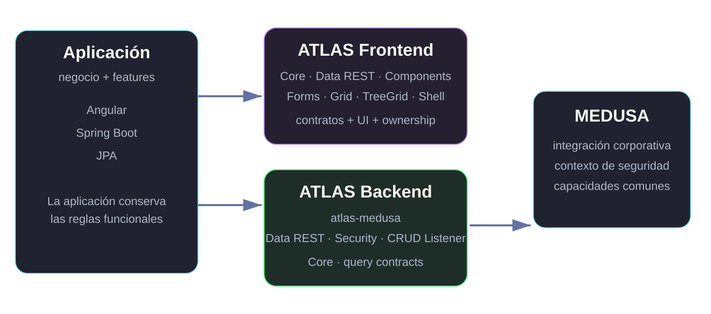
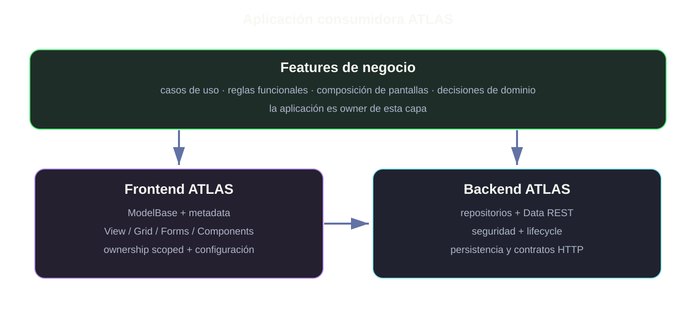
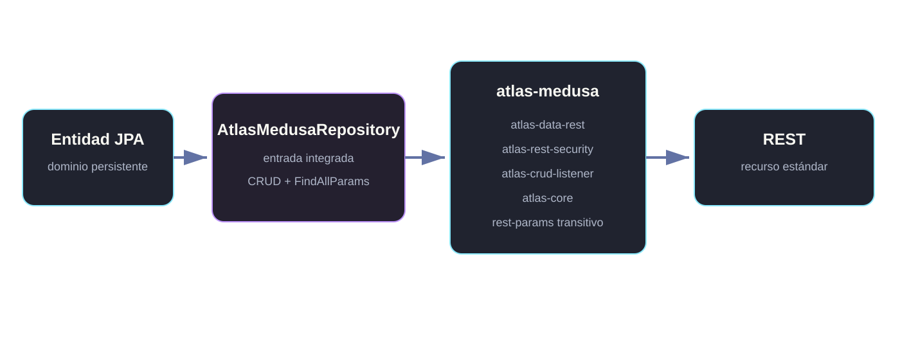
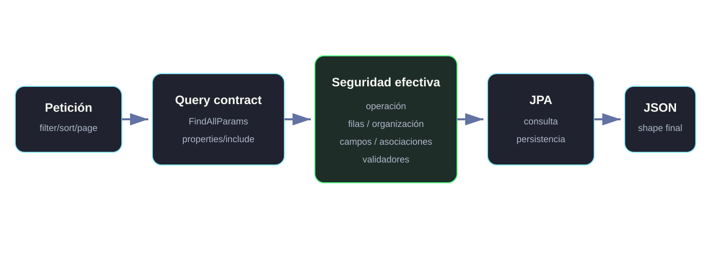
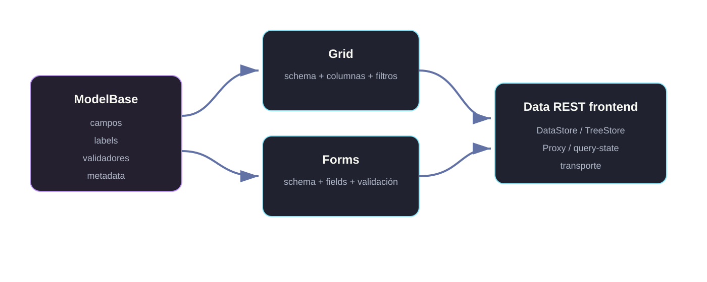
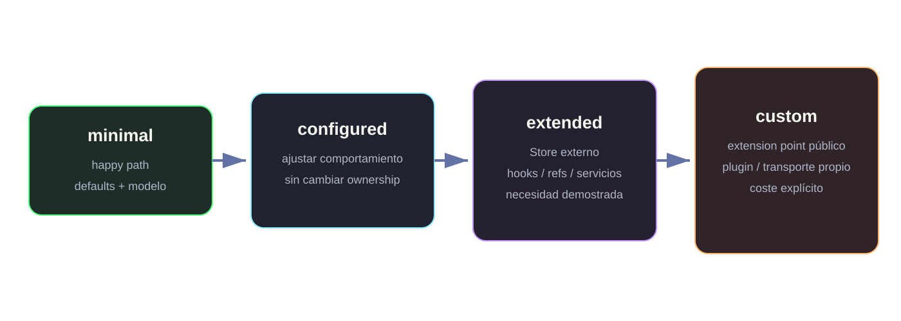
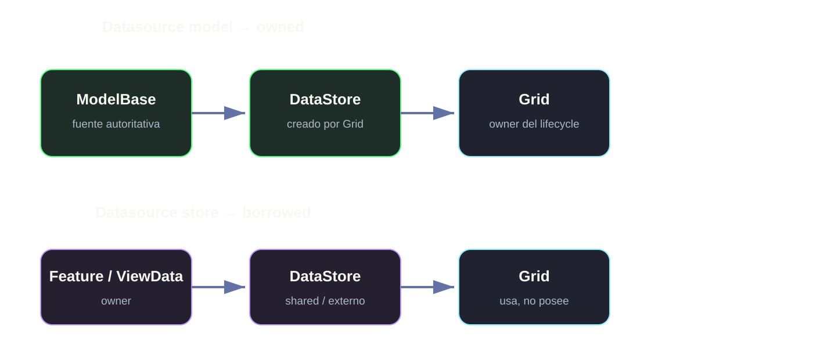
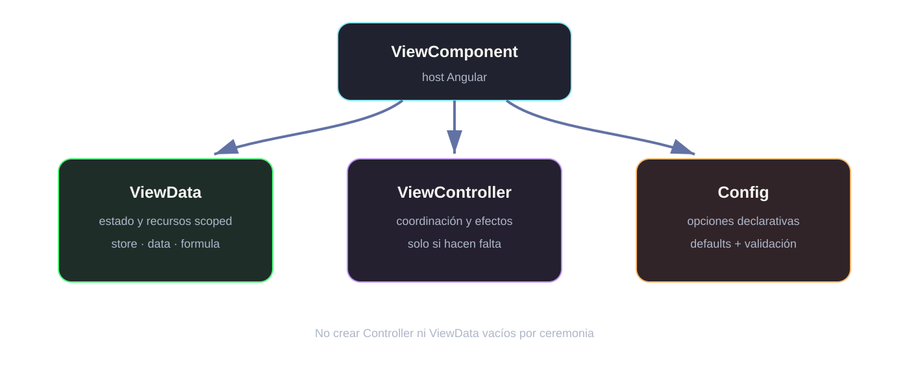
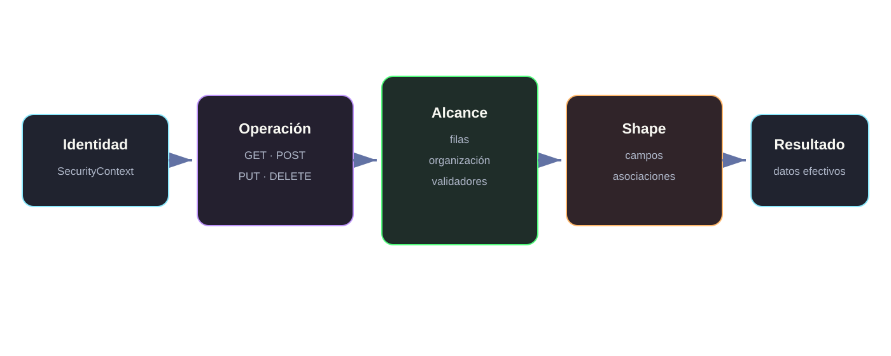
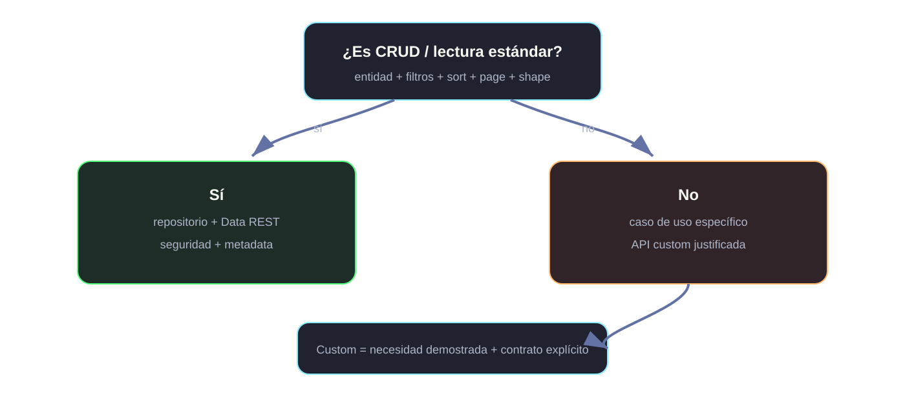

# ATLAS 3
## Arquitectura y modelo mental de consumo

Curso ATLAS 3 · Módulo 00

**Primero entendemos las responsabilidades. Después escribimos código.**

<small>Baseline documental: ATLAS3 / CorreccionesErrorFront · 15-09-2026</small>

Notas:
Objetivo de esta sesión: que el alumno pueda dibujar una aplicación ATLAS y explicar quién es owner de cada responsabilidad antes de memorizar APIs.

---

# Objetivos de la sesión

### Al terminar podrás

- explicar qué resuelve ATLAS 3;
- situar ATLAS y MEDUSA;
- dibujar el flujo backend ↔ frontend;
- distinguir ownership de datos, View y seguridad;
- elegir entre consumo minimal, configured, extended o custom.

### Todavía no buscamos

- memorizar clases;
- estudiar todos los parámetros;
- crear plugins;
- recorrer módulos avanzados;
- sustituir la documentación de API por las slides.

---

# Fuente y baseline

### Contrato técnico

La referencia del curso es la documentación **code-adjacent** de ATLAS 3:

- package README;
- QUICKSTART;
- ARCHITECTURE;
- API;
- module-manifest;
- ejemplos del propio paquete.

### Regla de evidencia

`stage: stable` describe madurez de producto.

**No significa que cada HEAD esté compilado, empaquetado, testeado y aceptado.**

El curso diferencia contrato documental y evidencia ejecutada.

Fuente: atlas-backend/module-manifest.yml y atlas-angular/docs/CATALOGO-MODULOS-CONSUMO.md.

---

# ¿Qué problema resuelve ATLAS?

<h3>Convención</h3>
Un modo común de construir aplicaciones corporativas sin reinventar cada pantalla o endpoint.

<h3>Integración</h3>
Datos, seguridad, lifecycle y UI trabajan sobre contratos compatibles.

<h3>Extensión controlada</h3>
Permite salir del happy path, pero exige una necesidad real y un extension point público.

> ATLAS no sustituye Spring ni Angular. **Organiza capacidades recurrentes y sus fronteras.**

---

# El ecosistema ATLAS 3

Backend integrado: atlas-medusa agrega Data REST, seguridad, CRUD Listener y Core. Frontend: Core, Data REST, Components, Forms, Grid y TreeGrid forman el núcleo prioritario del curso.

---

# Arquitectura de una aplicación consumidora

### La aplicación conserva el negocio

ATLAS aporta infraestructura y contratos; **la feature sigue siendo propietaria de sus reglas de negocio y de las decisiones funcionales**.

---

# Backend: happy path integrado

<h3>ATLAS + MEDUSA</h3>
La entrada recomendada es <strong>atlas-medusa</strong> y el repositorio integrado es <strong>AtlasMedusaRepository</strong>.

<h3>Standalone</h3>
<code>AtlasRestRepository</code> queda para Data REST standalone o desarrollo de librería.

No se enseña AtlasRestRepositoryImpl ni clases base internas como API de consumidor.

---

# Data REST es el eje del flujo

### Idea clave

Un CRUD estándar no necesita empezar creando un controller custom.

**Primero comprobar si el caso cabe en el contrato de repositorio + query DSL + seguridad.**

---

# Frontend: el modelo como contrato

### Model-first

La metadata del modelo puede alimentar schema, labels, validación y comportamiento de componentes.

**Duplicar esa información manualmente debe ser una decisión, no la rutina.**

---

# La escalera común de consumo

La misma progresión aparece en Core, Components, Forms, Grid, TreeGrid y en los ejemplos de aprendizaje.

---

# Grid: ownership antes que opciones

<h3>Model → owned</h3>
Grid materializa y gobierna su DataStore scoped.

<h3>Store → borrowed</h3>
La feature crea y conserva el Store; Grid lo usa sin adquirir su lifecycle.

### Pregunta que debe hacerse el alumno

**¿Quién debe poseer realmente este Store?**

---

# Forms: model-first y config-first

<h3>Modelo</h3>
ModelBase + metadata es la fuente preferida cuando representa la entidad.

<h3>Config</h3>
SForm recibe un contrato único de configuración en lugar de inputs paralelos.

<h3>Proxy</h3>
Carga y guardado pertenecen al pipeline del formulario; un DataStore auxiliar no se convierte en owner del record principal.

<strong>ModelBase</strong> → <strong>SFormConfigInput</strong> → <strong>SForm</strong> → <strong>proxy efectivo</strong> → backend

---

# ¿Cuándo aparece ViewComponent?

### Regla

Un componente Angular normal es suficiente para presentación y estado local pequeño.

**ViewComponent aparece cuando existen estado, recursos o coordinación scoped que merecen owners explícitos.**

---

# Components y Shell

<h3>Components</h3>
Primitives reutilizables: layout, fields, ventanas, diálogos, feedback, navegación y acciones.
  
No sustituyen HTML/CSS trivial.

<h3>Shell</h3>
Compone la experiencia global de aplicación: navegación, chrome y capacidades transversales.
  
No debe absorber la lógica funcional de cada feature.

### UX por rol ≠ autorización

Ocultar o deshabilitar una acción en frontend mejora la UX, pero **la seguridad efectiva vive en backend**.

---

# Seguridad por capas

### Orden mental

**identidad → autorización de operación → alcance de datos → campos/asociaciones → resultado efectivo**

`@BeforeRead` puede participar en lifecycle, pero no sustituye este pipeline.

---

# TreeGrid: jerarquía es otra capability

<h3>Grid</h3>
Colección plana y comportamiento tabular.

<h3>TreeGrid</h3>
Reutiliza schema tabular, pero añade capability jerárquica: root, children, expansión, selección tree, filtros y carga de ramas.

<strong>schema</strong> = columnas · <strong>tree</strong> = jerarquía y comportamiento

> TreeGrid no es simplemente “Grid + una columna tree”.

---

# CRUD estándar o API custom

### Política docente

El alumno debe aprender primero a **no crear complejidad innecesaria**.

Custom no significa “más profesional”. Significa que existe una necesidad que el contrato estándar no cubre.

---

# Mapa de aprendizaje

00 Arquitectura
01 Backend + Data REST
02 ModelBase + metadata
03 Grid + Forms
04 ViewComponent + Components
05 Seguridad + CRUD lifecycle
06 Relaciones + TreeGrid
07 Casos avanzados

### Núcleo antes que catálogo

Los módulos avanzados se estudian después de dominar los contratos transversales y siempre atendiendo a su madurez y evidencia real.

---

# El modelo mental que queremos conservar

<h3>Antes de implementar</h3>

1. ¿Qué capability necesito?
2. ¿Quién es owner?
3. ¿Cuál es el happy path?
4. ¿Qué metadata ya existe?
5. ¿La seguridad está en backend?
6. ¿Hay una razón objetiva para extender?

<h3>Resultado esperado</h3>

Una solución que usa ATLAS como plataforma coherente, no como una colección de componentes independientes.

 

<strong>Menos wiring accidental. Más contrato explícito.</strong>

---

# Siguiente módulo
## Backend + Data REST

Partiremos de una entidad y seguiremos el flujo hasta el endpoint REST, manteniendo el mismo criterio:

**minimal → configured → extended → custom**

<small>La API concreta se consulta en ATLAS3; las slides explican el porqué y el modelo mental.</small>
