# ATLAS 3
## Arquitectura completa y Happy Path end-to-end

<div class="atlas-kicker">Curso ATLAS 3 · Módulo 01</div>

**Un caso realista desde pantalla hasta base de datos y vuelta.**

<small>Dominio conductor: Taller · Orden de Trabajo · Vehículo · Cliente · Área · Operario</small>

Notas:
Este módulo amplía la introducción. Aquí ya mostramos responsabilidades, anotaciones, APIs públicas y puntos de extensión, sin convertir la presentación en documentación exhaustiva.

---

# De qué va esta sesión

<div class="atlas-grid atlas-grid-2">

<div class="atlas-card">

### Objetivo

Construir un mapa mental suficientemente preciso para saber:

- qué módulo ATLAS participa;
- qué responsabilidad tiene;
- qué recibe y qué produce;
- qué es happy path;
- dónde se puede extender.

</div>

<div class="atlas-card">

### Caso conductor

Una pantalla de **Órdenes de Trabajo** permite:

- listar y filtrar órdenes;
- editar una orden;
- seleccionar vehículo y cliente;
- aplicar seguridad por rol/organización;
- disparar validaciones de ciclo CRUD;
- consultar áreas jerárquicas del taller.

</div>

</div>

---

# Arquitectura completa

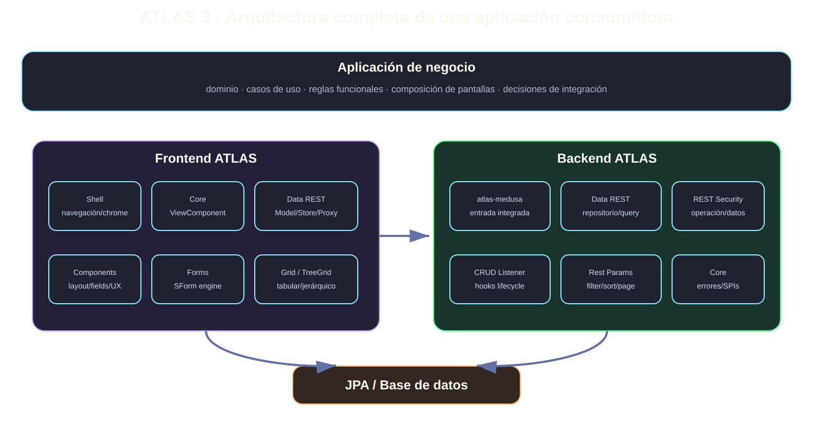

<div class="atlas-source">La aplicación conserva el dominio. ATLAS aporta contratos reutilizables para datos, UI, seguridad, lifecycle y publicación REST.</div>

Notas:
Insistir en que ATLAS no es una caja única. Es un conjunto de módulos con fronteras de responsabilidad.

---

# Capas y responsabilidades

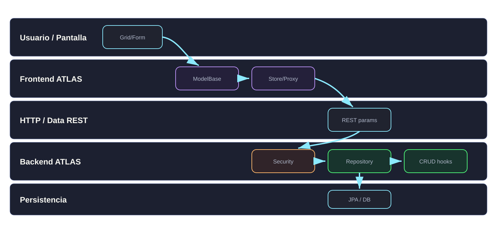

### Lectura de la arquitectura

**Pantalla → Modelo frontend → Store/Proxy → HTTP → Seguridad → Repositorio → Hooks → JPA → DB**

Cada capa añade una responsabilidad. Ninguna capa debería duplicar lo que ya resuelve otra.

---

# Mapa de módulos ATLAS

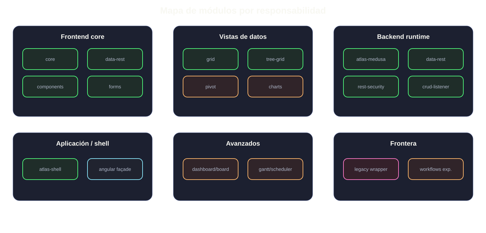

<div class="atlas-grid atlas-grid-2">

<div class="atlas-card">
<h3>Núcleo del curso</h3>
Core · Data REST · Components · Forms · Grid · TreeGrid · Shell · atlas-medusa
</div>

<div class="atlas-card">
<h3>Después</h3>
Charts · Pivot · Board · Dashboard · Scheduler · Gantt · Workflows
</div>

</div>

---

# Happy Path end-to-end

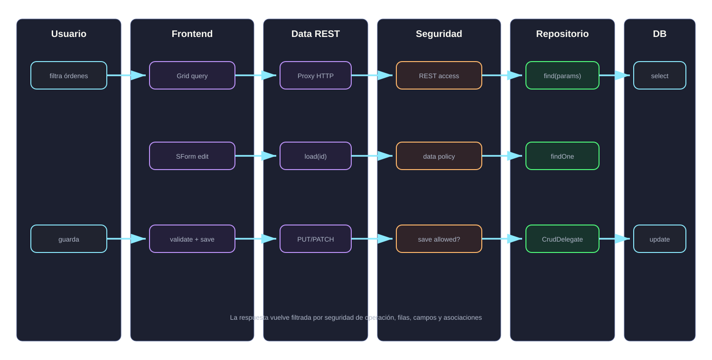

### Operación ejemplo

El usuario filtra órdenes abiertas del área “Chapa”, abre una orden, cambia prioridad y guarda.

---

# Backend: entrada integrada

<div class="atlas-grid atlas-grid-2">

<div class="atlas-card">

### Happy path integrado

```java
@RepositoryRestResource(path = "ordenTrabajo")
public interface OrdenTrabajoRepository
    extends AtlasMedusaRepository<OrdenTrabajo, Long> {
}
```

</div>

<div class="atlas-card">

### Responsabilidad

- exponer CRUD estándar;
- aceptar filtros/sort/page/properties;
- integrarse con seguridad;
- activar lifecycle CRUD/READ;
- evitar controller custom innecesario.

</div>

</div>

<div class="atlas-callout">En una app ATLAS + MEDUSA, el repositorio integrado es <strong>AtlasMedusaRepository</strong>. <code>AtlasRestRepository</code> queda para standalone o desarrollo de librería.</div>

---

# Backend: entidad y contrato de dominio

<div class="atlas-grid atlas-grid-2">

<div class="atlas-card">

```java
@Entity
public class OrdenTrabajo {
  @Id
  private Long id;

  @NotBlank
  private String codigo;

  @Min(1)
  @Max(5)
  private Integer prioridad;

  @ManyToOne
  private Vehiculo vehiculo;

  @ManyToOne
  private AreaTaller area;
}
```

</div>

<div class="atlas-card">

### Qué pertenece aquí

- identidad persistente;
- relaciones;
- validaciones de dominio;
- reglas estructurales;
- restricciones JPA/Bean Validation.

### Qué no pertenece aquí

- visibilidad de columna;
- formato visual del grid;
- lógica de pantalla.

</div>

</div>

---

# Backend: consulta rica sin controller

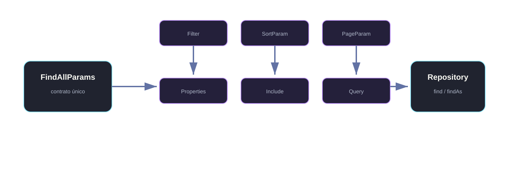

<div class="atlas-grid atlas-grid-2">

<div class="atlas-card">

```java
FindAllParams params = new FindAllParams()
  .withFilter(Filter.eq("estado", "ABIERTA"))
  .withSort(SortParam.create().addDesc("prioridad"))
  .withPage(PageParam.builder().page(1).limit(20).build());
```

</div>

<div class="atlas-card">

### Capacidades Data REST

- filtros compuestos;
- ordenación;
- paginación;
- búsqueda libre;
- `properties`;
- `includeAssociations`;
- proyección segura.

</div>

</div>

---

# Backend: seguridad declarativa

<div class="atlas-grid atlas-grid-2">

<div class="atlas-card">

```java
@RepositoryRestResource(path = "ordenTrabajo")
@AtlasRestSecurity(
  tipo = TipoAcceso.AUTENTICADO,
  accesoCreate = TipoAcceso.ROL,
  rolesCreate = {"JEFE_TALLER"},
  accesoUpdate = TipoAcceso.ROL,
  rolesUpdate = {"JEFE_TALLER"}
)
@AtlasFiltroOrganizacion(campo = "area.organizacionId")
@AtlasDataSecurity(
  source = DataPolicySource.ANNOTATION,
  rolesPolicies = {
    @RoleDataAccess(
      role = "GESTOR_TALLER",
      allowedFields = {"id", "codigo", "estado", "prioridad"},
      allowedRoutes = {"vehiculo", "area"},
      maxDepth = 1
    )
  }
)
public interface OrdenTrabajoRepository
    extends AtlasMedusaRepository<OrdenTrabajo, Long> {}
```

</div>

<div class="atlas-card">

### Responsabilidad de seguridad

- operación permitida;
- roles;
- datos permitidos;
- campos/asociaciones;
- filtro organizativo;
- validadores custom.

### Regla

UX por rol en frontend no sustituye autorización backend.

</div>

</div>

---

# Backend: lifecycle CRUD/READ

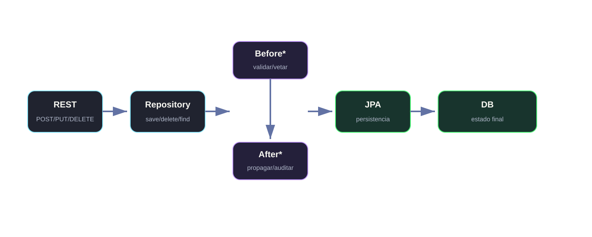

<div class="atlas-grid atlas-grid-2">

<div class="atlas-card">

```java
@CrudDelegate(OrdenTrabajoCrudDelegate.class)
@Entity
public class OrdenTrabajo { ... }

@Service
public class OrdenTrabajoCrudDelegate
    implements CrudDelegateService<OrdenTrabajo> {

  @BeforeCreate
  public void validarAlta(OrdenTrabajo orden, CrudContext ctx) { ... }

  @BeforeRead
  public void observarLectura(CrudContext ctx) { ... }
}
```

</div>

<div class="atlas-card">

### Úsalo para

- reglas del ciclo de entidad;
- validaciones transversales;
- propagaciones controladas;
- auditoría funcional;
- evitar duplicar hooks REST/repository/JPA.

### No lo uses como

sustituto general de autorización o política de datos.

</div>

</div>

---

# Frontend: modelo ATLAS

<div class="atlas-grid atlas-grid-2">

<div class="atlas-card">

```ts
export class OrdenTrabajo extends ModelBase {
  static readonly URL = 'rest/ordenTrabajo';

  @Column() id!: number;

  @Column()
  @Label('Código')
  @Validator({ required: true })
  codigo = '';

  @Column()
  @Label('Prioridad')
  @Validator({ min: 1, max: 5 })
  prioridad = 3;

  @Column('vehiculo.matricula')
  @Label('Vehículo')
  vehiculoMatricula = '';
}
```

</div>

<div class="atlas-card">

### Responsabilidad del modelo frontend

- URL del recurso;
- metadata reutilizable;
- labels;
- columnas;
- validaciones;
- display fields;
- mapeos de propiedades remotas.

### Evita

duplicar schema manual si el modelo ya describe la pantalla suficientemente.

</div>

</div>

---

# Frontend: camino de datos

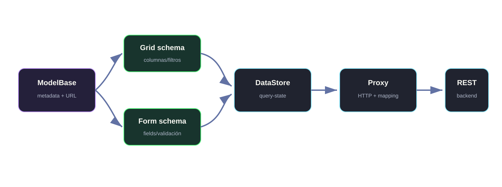

### Idea clave

El flujo no empieza por `HttpClient`.

Empieza por **ModelBase + metadata** y deja que Data REST materialice Store/Proxy cuando el caso es estándar.

---

# Grid: de minimal a extended

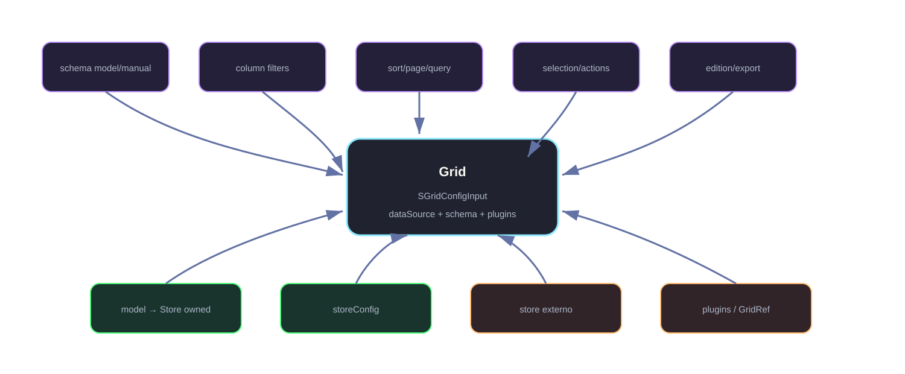

<div class="atlas-grid atlas-grid-2">

<div class="atlas-card">

```ts
readonly gridConfig: SGridConfigInput<OrdenTrabajo> = {
  dataSource: { kind: 'model', model: OrdenTrabajo },
  schema: { kind: 'automatic' },
  pageSize: 20
};
```

</div>

<div class="atlas-card">

### Grid resuelve

- columnas;
- filtros;
- sort;
- paginación;
- selección;
- edición;
- export;
- plugins;
- estado visual.

</div>

</div>

---

# Forms: edición de la orden

<div class="atlas-grid atlas-grid-2">

<div class="atlas-card">

```ts
readonly formConfig: SFormConfigInput<OrdenTrabajo> = {
  model: OrdenTrabajo,
  mode: 'edit',
  id: ordenId,
  window: false
};
```

</div>

<div class="atlas-card">

### SForm coordina

- modo create/edit/details;
- carga por id;
- FormGroup;
- validación;
- proxy efectivo;
- save;
- errores;
- outputs.

### Components aporta

fields visuales y CVA reutilizables.

</div>

</div>

<div class="atlas-flowline">
<strong>ModelBase</strong> → <strong>SFormConfigInput</strong> → <strong>SFormEngine</strong> → <strong>proxy.save()</strong> → backend
</div>

---

# ViewComponent cuando la pantalla escala

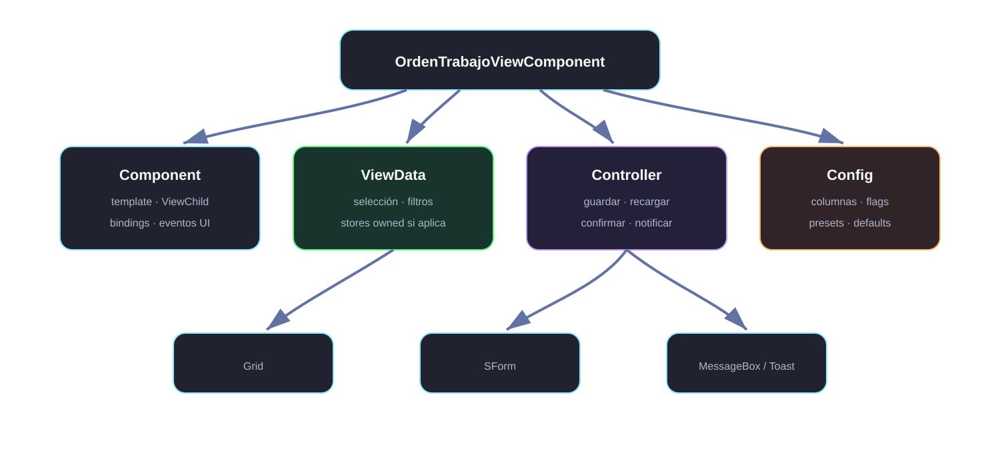

### Ejemplo realista

La pantalla ya no solo muestra un grid: coordina selección, edición, confirmaciones, recarga, notificaciones, filtros externos y permisos de UX.

Ahí ViewComponent empieza a aportar separación real.

---

# TreeGrid: áreas del taller

<div class="atlas-grid atlas-grid-2">

<div class="atlas-card">

```ts
readonly treeGridConfig: STreeGridConfigInput<AreaTaller> = {
  dataSource: { kind: 'model', model: AreaTaller },
};
```

</div>

<div class="atlas-card">

### TreeGrid añade

- root nodes;
- children lazy;
- expansión/colapso;
- selección jerárquica;
- filtros con ancestros;
- TreeStore;
- TreeGridRef.

### Regla

No modelar jerarquía como “Grid + indentación”.

</div>

</div>

---

# Puntos de extensión por capa

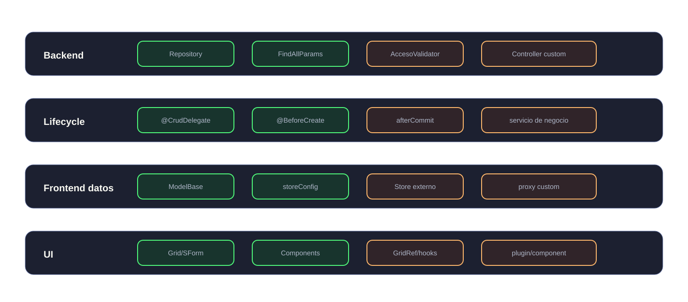

### Criterio

Extender no es saltarse ATLAS.

Extender es usar un punto público porque el happy path ya no cubre la necesidad.

---

# Antipatrones que queremos evitar

<div class="atlas-grid atlas-grid-2">

<div class="atlas-card bad">

### Backend

- controller custom para CRUD simple;
- seguridad solo en frontend;
- duplicar hooks en controller y JPA;
- exponer campos y filtrar luego en Angular;
- usar clases internas como API.

</div>

<div class="atlas-card bad">

### Frontend

- empezar por `HttpClient`;
- Store externo sin owner real;
- schema manual duplicando metadata;
- ViewController vacío;
- Components sustituyendo Forms sin motivo;
- TreeGrid simulado con Grid plano.

</div>

</div>

---

# Decisiones de arquitectura

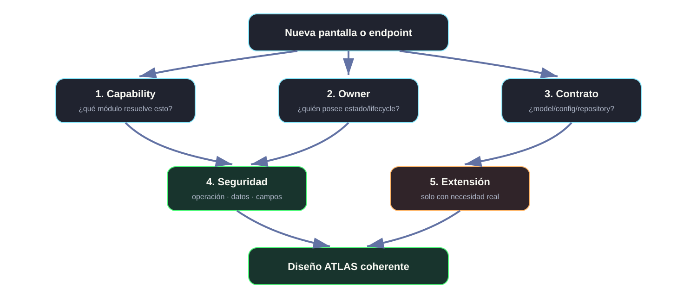

### Pregunta final

Para cada pantalla o endpoint debemos poder responder:

**capability → owner → contrato → seguridad → extensión**

---

# Roadmap de profundización

<div class="atlas-roadmap">

<span>01 Arquitectura completa</span>
<span>02 Backend + Data REST</span>
<span>03 Seguridad + CRUD lifecycle</span>
<span>04 ModelBase + metadata</span>
<span>05 Grid + Forms</span>
<span>06 ViewComponent + Components</span>
<span>07 Relaciones + TreeGrid</span>
<span>08 Avanzados</span>

</div>

### El siguiente módulo

Backend + Data REST con el dominio del taller y ejemplos más completos.
